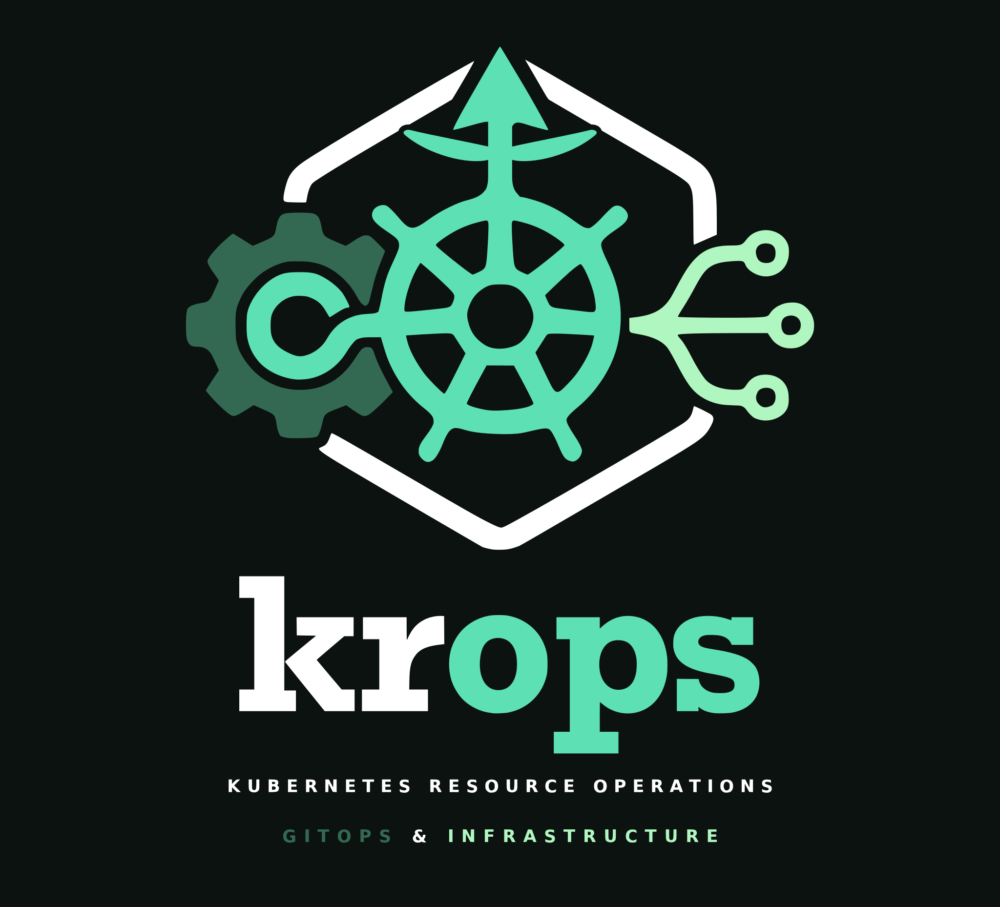

# kaipr



kaipr is a reference that shows how to run a complete **AI platform** on a
single computer using Kubernetes and GitOps, with no cloud account and no GPU.
You run one command, and a management cluster, a workload cluster, and an AI
inference gateway all come up from a single folder of YAML in Git.

It has two halves in one repository:

- **A lean base.** A throwaway local cluster that hands itself over to a
  self-managed Kubernetes control plane, everything running in containers on
  your machine. This scaffolding is derived from
  [krops](https://github.com/polarsquad/krops), an open-source tool for
  GitOps-managed Kubernetes clusters: the bootstrap engine, the toolbox, and
  the repository layout are krops' here, scoped down to one environment.
- **An AI platform built on [agentgateway](https://agentgateway.dev).** A
  gateway that routes AI chat requests to a model, picks the best model server
  for each request, and enforces token budgets. The model runs as a CPU
  simulator by default, so you can try the whole thing with no hardware or API
  keys.

You do not need Kubernetes experience to follow the quickstart, but the
machine does need a way to run [Docker](https://www.docker.com/) (or
[Podman 5.5+](https://podman.io/)).

## What you get

- A self-managed management cluster and a workload cluster on one host, all in
  Docker containers.
- An AI inference gateway in front of the model, with per-request routing and
  a token budget.
- One Git repository as the source of truth: change a file, push it, and the
  clusters converge to match. No second toolchain, no state file, no cloud
  credentials.

## Quickstart

Build the toolbox image from the repository, then run the whole lifecycle:

```sh
docker build -f bootstrap-rs/Dockerfile -t kaipr-toolbox:dev .
export TOOLBOX_IMAGE=kaipr-toolbox:dev
mkdir -p .kube
cp .env.example .env        # no cloud credentials needed
scripts/toolbox-run.sh bootstrap
```

That one command starts the local clusters, publishes this checkout to a local
registry, and reconciles the management cluster, the workload cluster, and the
AI platform from Git. Watch it land:

```sh
export KUBECONFIG="$PWD/.kube/kaipr-mgmt.yaml"
flux get kustomizations --watch
```

Once everything is Ready, send a chat request through the gateway to see the
AI path end to end. The simulator answers without any real model:

```sh
kubectl port-forward -n ai-platform svc/inference-gateway 18080:80
curl -s http://localhost:18080/v1/chat/completions \
  -H 'content-type: application/json' \
  -d '{"model":"Qwen/Qwen3-32B","messages":[{"role":"user","content":"hi"}],"max_tokens":8}'
```

Run the reference checks from the host:

```sh
mise run validate
```

Tear the whole stack down again with:

```sh
scripts/toolbox-run.sh teardown
```

On macOS the exported kubeconfig points at the `kind` Docker network, which
Docker Desktop does not route; rewrite a host copy before the `export` above.
Linux hosts need no rewrite. See
[Host-side access after a toolbox local-host run (macOS)](docs/operations.md#host-side-access-after-a-toolbox-local-host-run-macos).

## Going deeper

- [Inference platform](docs/inference.md) - the AI layer, the request path, and the vLLM overlay
- [Architecture](docs/architecture.md) - how the pieces fit
- [Operations](docs/operations.md) - toolbox runs, helper tasks, verification
- [Bootstrap CLI](docs/bootstrap-cli.md) - the `kaipr-bootstrap` engine and its knobs
- [Secrets](docs/secrets.md) - SOPS/age for in-tree secrets
- [Dependencies](docs/dependencies.md) - version surfaces and the update procedure
- [Adding clusters and apps](docs/extending.md) - extending the reference
- [PR review: konflate](docs/konflate.md) - rendering Flux resources for review

## Repository layout

```
.
├── bootstrap.toml              # environment + chart config for kaipr-bootstrap
├── bootstrap.sh                # local-host lifecycle: seed Flux, pivot, reconcile
├── pivot.sh                    # pivot a bootstrap cluster to self-managed
├── teardown.sh                 # reverse-order cleanup
├── bootstrap-common.sh         # shared helpers
├── bootstrap-rs/               # the generic Rust bootstrap engine (kaipr-bootstrap)
│   ├── Dockerfile              # the toolbox image (mise + podman remote client)
│   └── src/
├── scripts/
│   └── toolbox-run.sh          # Docker/Podman wrapper for the toolbox
├── mgmt/
│   └── local-host/             # management cluster: CAPI providers, CAPD, Flux apps
│       ├── capi-providers/     #   cluster-api, capd, cluster-api-addon-provider
│       ├── infrastructure/     #   flux-operator, cert-manager, capi-operator
│       ├── addons/             #   flux-apps, cni
│       └── clusters/           #   management + docker workload cluster class
├── workload/
│   └── local-host/             # workload cluster apps, delivered from Git
│       ├── podinfo/            #   the reference app (smoke test)
│       ├── ai-platform/        #   the AI inference platform
│       │   ├── crd/            #     CRDs: vendored gateway-api + agentgateway-crds
│       │   └── app/            #     agentgateway, model-server, inference, policies
│       └── flux-ks.yaml        #   the two Flux Kustomizations (app dependsOn crd)
├── tests/                      # self-contained cross-checks (run by mise validate)
├── docs/
└── .github/workflows/          # validate, bootstrap-rs, konflate, toolbox-release
```

## Validation

`mise run validate` (and the `validate` GitHub Action) gate every change:
shell scripts parse, the `bootstrap.toml` cross-checks the imperative chart
pins against the Flux-reconciled versions, every kustomization under `mgmt/`
and `workload/` builds, and the toolbox / kubeconfig / docs cross-checks pass.
The Rust engine has its own `fmt` / `clippy` / `test` gate.

## License

Apache-2.0, like krops. See [LICENSE](LICENSE).
