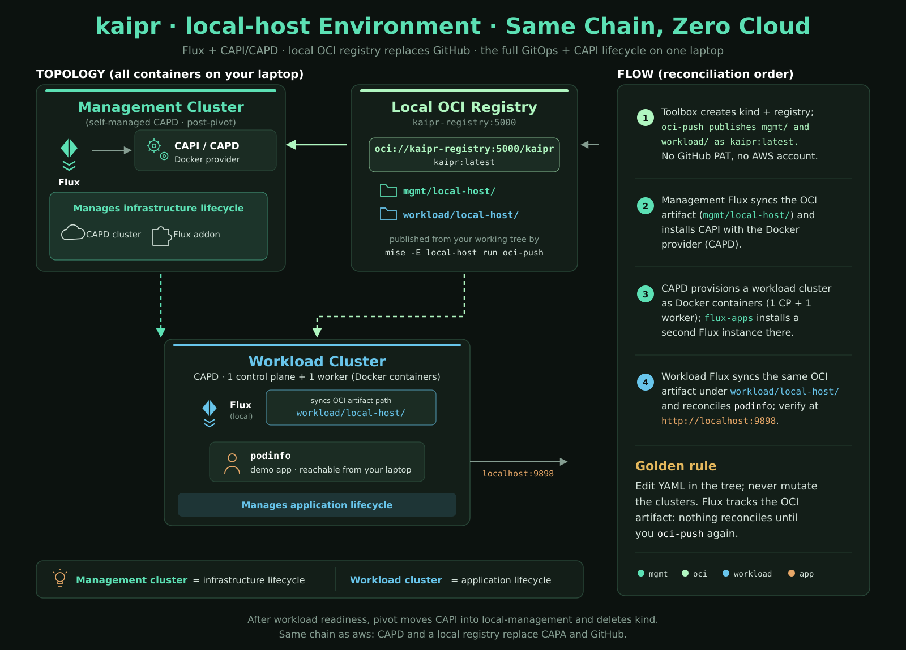
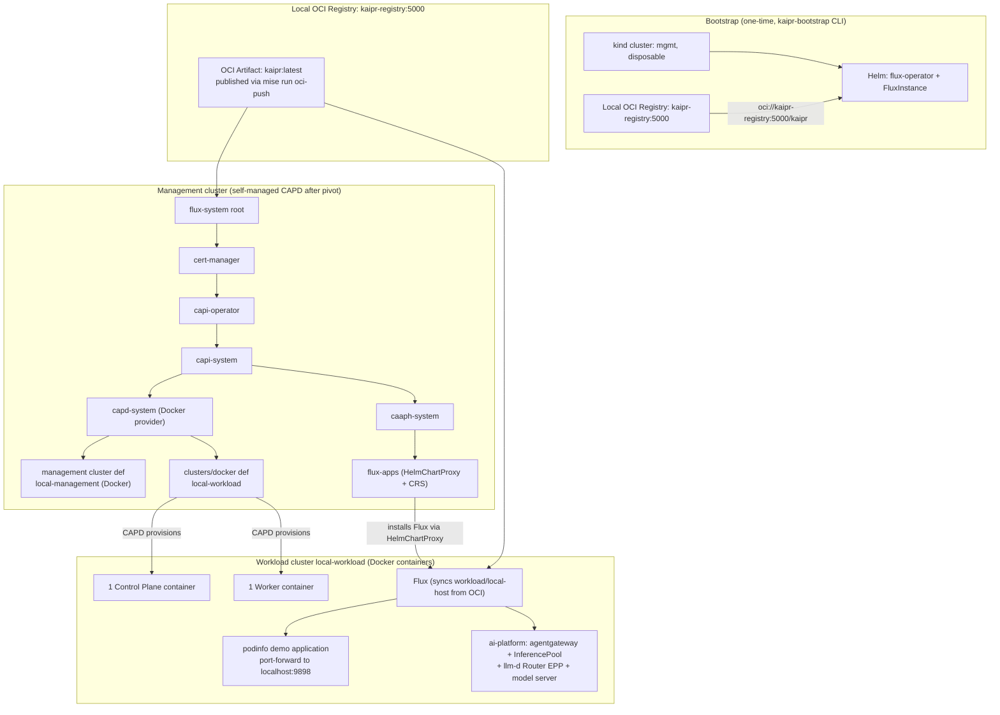

# Architecture

GitOps-driven [Cluster API](https://cluster-api.sigs.k8s.io/) (CAPI) management
platform, on a single host. A disposable local [kind](https://kind.sigs.k8s.io/)
cluster bootstraps [Flux](https://fluxcd.io/), provisions the self-managed
management cluster through CAPI + CAPD, and is deleted after a
`clusterctl move` pivot. The management cluster then reconciles itself and all
downstream infrastructure - and the AI platform - from this repository.

The GitOps scaffolding (bootstrap engine, toolbox, and repository layout) is
derived from [krops](https://github.com/polarsquad/krops). krops ships multiple
cloud environments; kaipr keeps the scaffolding and scopes it to one
environment, `local-host`, so the whole thing runs on a laptop with no cloud
account. The environment is declared in [`bootstrap.toml`](../bootstrap.toml),
which is the single source of truth for what environments exist.

The operator normally runs the imperative lifecycle through the
`kaipr-toolbox` container. It mounts the host engine socket, joins the kind
network while the bootstrap cluster exists, and leaves no toolbox workload in
the managed clusters. This packaging changes the host tool boundary, not the
Flux or CAPI reconciliation architecture.

## The local-host environment

`local-host` replaces cloud providers with local Docker containers (CAPD) and
replaces GitHub with a local in-memory OCI registry (`kaipr-registry:5000`). It
provisions a one-control-plane/one-worker workload cluster and reconciles the
`podinfo` demo application and the `ai-platform` end to end on a single host.
No GitHub PAT, no cloud account, no GPU.

See the architecture diagram in [docs/local-host-infra.svg](local-host-infra.svg).





### Reconciliation order (local-host)

Management cluster:
```
cert-manager ▶ capi-operator ▶ capi-system ▶ capd-system ▶ clusters (local-management, local-workload)
                            │                            └▶ caaph-system ▶ cni ▶ flux-apps
```

Workload cluster (delivered wholesale by the workload Flux instance from the
same OCI artifact):
```
podinfo (HelmRelease) and ai-platform (agentgateway, model-server, inference, policies)
```

### How the workload cluster is populated

1. `flux-apps` on the management cluster installs the Flux Operator on the
   workload cluster (HelmChartProxy) and applies a `FluxInstance` that syncs
   `workload/local-host/` from the local OCI artifact.
2. The workload cluster's Flux reconciles `workload/local-host/` from that
   artifact. There is no separate Flux Kustomization per component: the whole
   tree (`podinfo/` and `ai-platform/`) is delivered wholesale.
3. Inside `ai-platform/`, the components reconcile in this order: the
   `agentgateway-crds` HelmRelease, then the `agentgateway` control plane,
   then the model server, the `InferencePool` + llm-d Router EPP, and the LLM
   policies that bind them together. See [Inference platform](./inference.md).

## The AI platform

The `ai-platform` kustomization on the workload cluster is an example of an AI
inference platform built on [agentgateway](https://agentgateway.dev). The
request path:

```
Client
  -> inference-gateway Gateway (agentgateway data plane)
  -> HTTPRoute vllm-sim-llm  (matches /v1/chat/completions)
  -> AgentgatewayBackend vllm-sim   (LLM-aware: token counting, token budget)
  -> InferencePool vllm-sim         (groups the model-server pods by label)
  -> llm-d Router EPP               (picks one pod via ext-proc)
  -> model-server pod (vllm-sim)
```

The full component list, the pinned versions, the CRD prerequisites, bring-up
verification, and the vLLM overlay for a real model are in
[Inference platform](./inference.md).

## Extending

To add a provider (AWS, Azure, GCP, Talos, or another) or a new workload
cluster or application, see [Adding clusters and apps](./extending.md). The
bootstrap engine (`bootstrap-rs/`) is deliberately generic over environments;
this reference simply enables one of them in `bootstrap.toml`.
